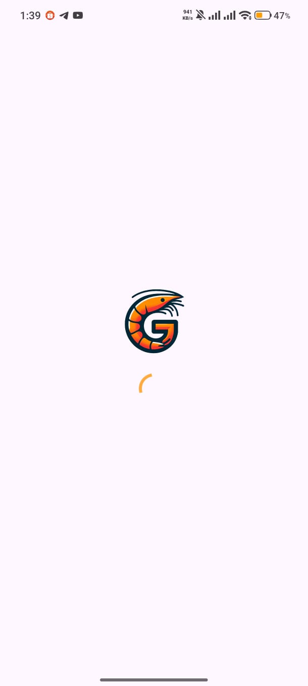
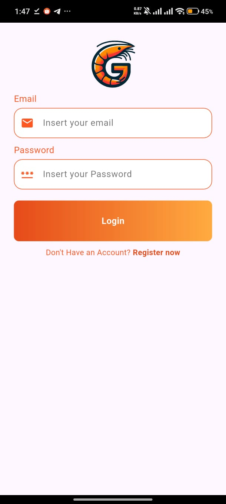
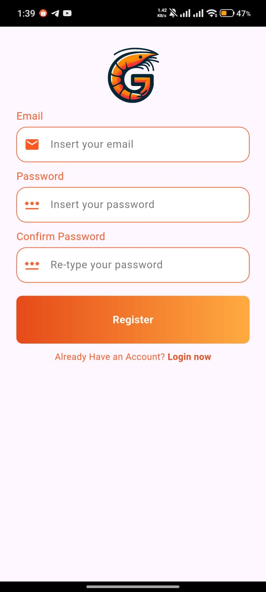
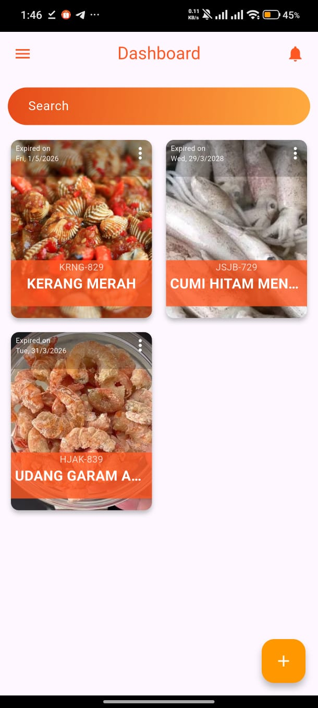
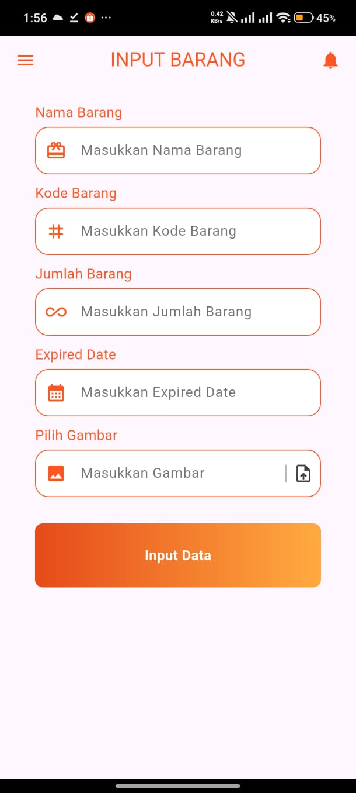
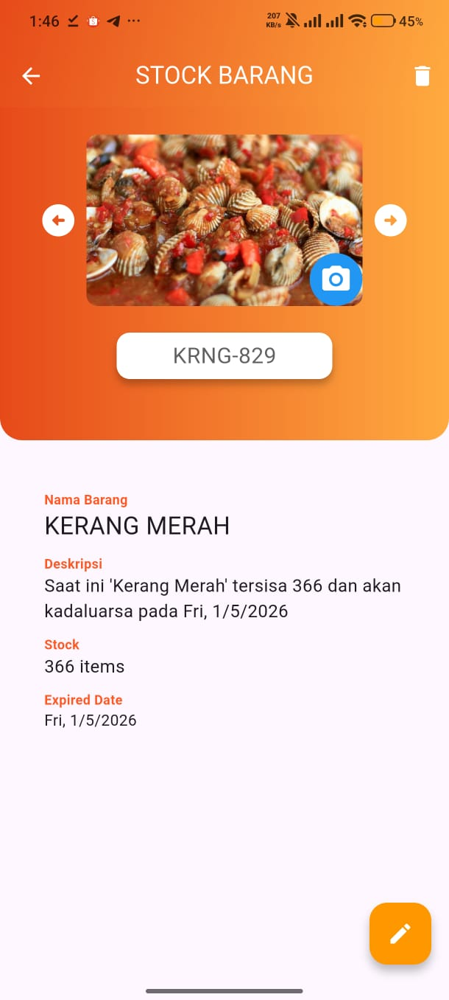
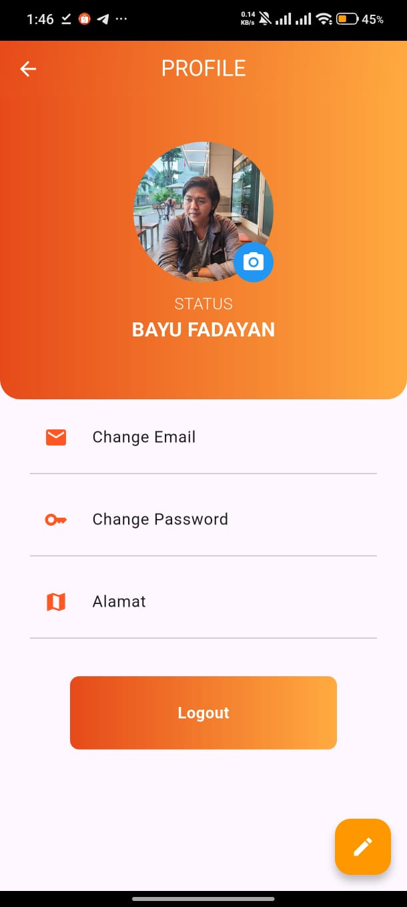
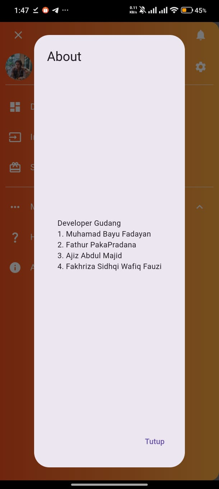

# Seafood Managing App (G-Stock)

Aplikasi manajemen stok seafood berbasis Flutter + Firebase untuk membantu pencatatan barang, monitoring stok, dan pengelolaan profil pengguna.

## Tentang Proyek

Project ini dibuat untuk memudahkan alur pengelolaan inventaris seafood secara sederhana:

- Registrasi dan login user
- Melengkapi profil pengguna
- Input barang
- Monitoring stok barang
- Pencarian data barang
- Manajemen data profil

## Fitur Utama

- Autentikasi pengguna dengan Firebase Authentication
- Penyimpanan data user dan item dengan Cloud Firestore
- Upload gambar profil ke Firebase Storage
- Dashboard stok dengan tampilan grid
- Drawer navigation untuk akses cepat ke halaman utama

## Tech Stack

- Flutter (Dart)
- Firebase Authentication
- Cloud Firestore
- Firebase Storage

## Screenshot Aplikasi

### Splash Screen


### 1. Halaman Login



### 2. Halaman Register



### 3. Complete Profile


### 4. Dashboard



### 5. Input Barang



### 6. Stock Barang



### 7. Profile



### 8. About



## Cara Menjalankan

1. Clone repository

```bash
git clone <url-repository>
cd seafood-managing-app
```

2. Install dependencies

```bash
flutter pub get
```

3. Pastikan konfigurasi Firebase sudah sesuai

- Android: `android/app/google-services.json`
- iOS: `ios/Runner/GoogleService-Info.plist` (jika digunakan)

4. Jalankan aplikasi

```bash
flutter run
```

## Struktur Folder Singkat

```text
lib/
	component/                # Reusable widgets (button, input, dll)
	firebase_auth_implementation/
	model/                    # Model data
	pages/                    # Halaman aplikasi
	main.dart
assets/
	secreenshot/              # Tempat screenshot README (tambahkan manual)
```

## Catatan

- Jika ingin menambahkan screenshot baru, cukup tambahkan file gambar ke `assets/secreenshot/` lalu update section screenshot di README ini.
- Pastikan dependency dan file konfigurasi Firebase sesuai environment device yang digunakan.
